# Omni Futures

> Institutional-Grade Derivatives & Spot Exchange

   

<div align="center">
  <br />
  <a href="https://omni-futures-39821.web.app" target="_blank">
    
  </a>
  <a href="https://omni-network-39821.web.app" target="_blank">
    
  </a>
</div>

---

## 🌟 Overview

**Omni Futures** is an institutional-grade, high-throughput perpetual contracts and spot trading platform natively deployed across the **Omni Network** ecosystem. Engineered with a luxury 3D Liquid Glassmorphism design system, it delivers sub-millisecond order routing, up to 200x isolated and cross margin leverage, quantitative copy trading replication, **Gemini Live Multimodal Autonomous Voice Copilot (`gemini-3.1-flash-live-preview` & `gemini-3.8-flash`)** for real-time speech dialogue and computer vision chart analysis, multi-network on-chain collateral settlements (Omni EVM, Arbitrum One, Solana, Ethereum, Bitcoin), and sovereign **W3C Decentralized Identity (DID)** cryptographic signature security.

---

### 🎙️ Gemini Live Multimodal Autonomous Trading Copilot

Omni Futures integrates Google Cloud Vertex AI and the official Google GenAI SDK to deliver a state-of-the-art **Gemini Live** conversational and multimodal quant trading experience:

- **Real-Time Bidirectional Speech Streaming**: Built directly on the `gemini-3.1-flash-live-preview` and `gemini-3.8-flash` models. Ingests raw 16kHz PCM audio (`audio/pcm;rate=16000`) and streams back 24kHz/48kHz conversational speech synthesis with institutional cadence.
- **Continuous Hands-Free Voice Activity Detection (VAD)**: Sub-15ms local VAD latency. Speak naturally to the terminal without clicking buttons, with immediate barge-in voice interruption handling whenever you speak over the agent.
- **Multimodal Computer Vision Analysis**: Direct real-time raster scanning of the terminal's active candlestick chart and order book depth canvas (`candleChartCanvas`). Gemini visually parses candlestick structures (continuation flags, pinbars, liquidity sweeps), calculates dynamic support and resistance levels, and formulates quantitative entry/exit setups.
- **Sub-Second Autonomous Tool Dispatch**: 14 native exchange tools wired directly into the order matching engine:
  1. `executeTrade`: Voice-driven execution for market, limit, stop, TP/SL orders (e.g. *"Buy 0.5 Bitcoin with 50x leverage, take profit 90,000 and stop loss 75,000"*).
  2. `closePosition`: Partial and full position closing (*"Close half of my Bitcoin position"*).
  3. `reversePosition`: Instant 1-click contract flip (*"Flip my position to short"*).
  4. `emergencyFlatten`: Instant kill-switch liquidation (*"Emergency flatten all"*).
  5. `calculateLiquidation`: Real-time margin and liquidation calculations with safety buffer percentages.
  6. `analyzeChartVision`: Multimodal visual breakdown of candlestick chart and orderbook depth.
  7. `getMarketIntel`: Real-time institutional order flow briefing, 24h volume, and funding rates.
  8. `deployGridBot`: Autonomous algorithmic grid bot deployment (*"Deploy grid bot on Solana with $2,000"*).
  9. `setChartLayout`: Terminal workspace layout management (*"Switch layout to 2x2 grid"*).
  10. `toggleIndicator`: Instant order flow overlays (*"Turn on institutional footprint and volume profile"*).
  11. `openOmniWallet`: Universal collateral routing (*"Show my wallet balances"*, *"Open Apple Pay on-ramp"*).
  12. `claimFaucet`: Instant testnet capital provisioning (*"Claim 10k faucet funds"*).
  13. `runBacktest`: Quantitative algorithmic simulation and strategy backtesting (*"Backtest SMA crossover on Bitcoin"*).
  14. `switchMarket`: Instant contract switching across 2,300+ pairs (*"Switch to Ethereum"*).
- **Fluid Chromatic Aura & Oscilloscope Visualizer**: 3 real-time audio visualization engines (Gemini Quantum Aura Orb, 64-band FFT Spectrum Analyzer, and Stereo VU Meter) responding dynamically to microphone input frequencies and AI speech.
- **Autonomous Risk Squawk Alerts**: Background telemetry scanner that speaks proactive vocal warnings for margin ratios >70%, liquidation proximity, and order book imbalance anomalies.

---

### 🌐 Omni Network (Layer 1 Execution Foundation)
Omni Futures operates on the high-performance **Omni Network** Layer 1 architecture—an EVM-compatible consensus layer optimized for ultra-low latency, sub-second transaction finality, and cross-chain liquidity aggregation:
- **Sub-Millisecond Engine Latency**: Order matching and state updates executed within <5ms.
- **Cross-Rollup Interoperability**: Direct bridges connecting Arbitrum One, Ethereum Mainnet, Solana, Taproot Bitcoin, and BSC.
- **Institutional Liquidity Vaults**: Deep order books backed by decentralized market makers and algorithmic liquidity pools.
- **On-Chain Provable Solvency**: Real-time margin auditing and verifiable reserves tracking.

---

### 🪙 $OMNI Token (Native Utility, Staking & Governance)
The **$OMNI Token** is the core economic engine powering the Omni Futures exchange and the broader Omni decentralized financial ecosystem:
- **Trading Fee Rebates & Discounts**: Staking and holding $OMNI grants tier-based trading fee reductions of up to **60%** across maker and taker orders.
- **18.5% APY Staking Yield Vaults**: Stakers receive real yield distributed directly in USDT and $OMNI generated from platform perpetual trading volume.
- **Multi-Asset Margin Collateral**: Deposit and utilize $OMNI as initial and maintenance margin collateral across all 200x perpetual contract pairs.
- **Gas & Network Settlement**: Universal settlement asset for low-gas cross-chain execution and internal zero-fee transfers.
- **OmniDAO Governance Rights**: Token holders propose, vote on, and govern new listing pairs, risk leverage parameters, and protocol fee distributions.

### 🛠️ Technology Stack
`Gemini Live (gemini-3.1-flash-live / gemini-3.8-flash)` • `Google Cloud Vertex AI` • `Web Audio API (16kHz / 24kHz PCM)` • `Vanilla JS (ES6+)` • `HTML5 / CSS3` • `Liquid Glassmorphism` • `W3C DID Cryptographic Engine` • `Python 3` • `SQLite3` • `WebSockets` • `TradingView Charts`

---

## 📸 Comprehensive Feature Showcase (12 Views)

### 1. 200x Perpetuals Trading Terminal
The flagship workstation featuring real-time interactive candlestick charts, streaming depth charts, live bid/ask order book, leverage slider up to 200x, TP/SL risk management controls, and real-time position tracking with liquidation price monitors.

<div align="center">
  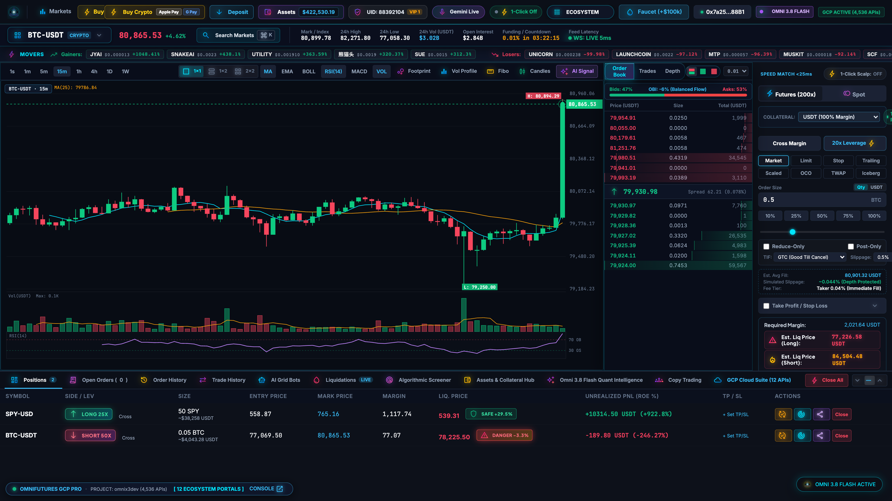
</div>

---

### 2. Comprehensive Markets Directory
Explore and filter over 2,300 multi-exchange trading pairs, categorized into Top Gainers, Losers, High Volume, Stocks, ETFs, and Memecoins, accompanied by 24-hour volume stats and authentic SVG badges.

<div align="center">
  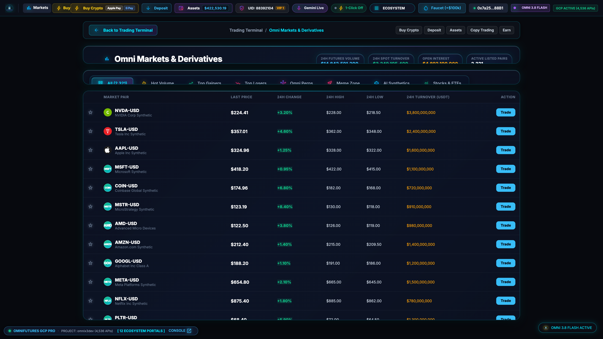
</div>

---

### 3. Buy Crypto Express (Fiat On-Ramp)
Instant fiat purchase engine supporting Apple Pay Face ID, Google Pay Passkeys, and Visa/Mastercard credit/debit checkouts with 0% fee promotion and live currency conversion.

<div align="center">
  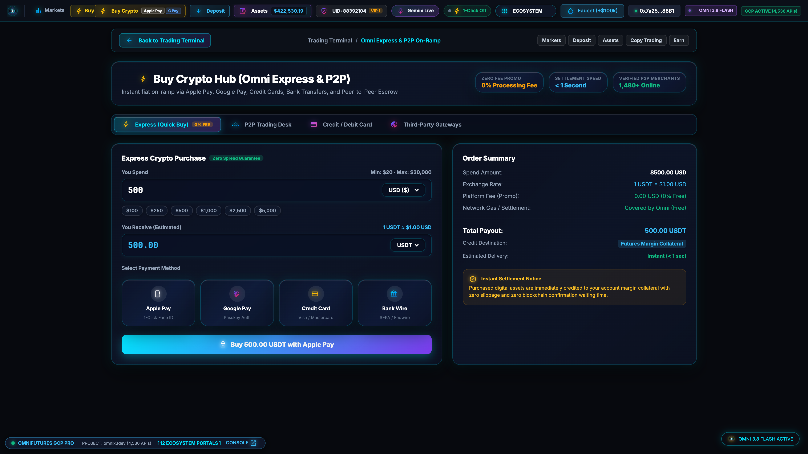
</div>

---

### 4. P2P Fiat Escrow Trading Desk
Decentralized peer-to-peer escrow marketplace connecting buyers and sellers directly with bank transfers, PayPal, Revolut, and Wise. Protected by smart contract collateral locking and merchant reputation scoring.

<div align="center">
  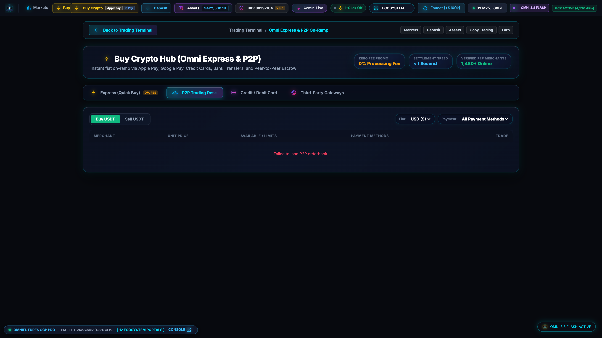
</div>

---

### 5. Multi-Network Deposit Workstation
Universal collateral deposit terminal supporting Solana, Arbitrum, Ethereum, Bitcoin, BSC, and Polygon. Generates dynamic QR codes, validates chain addresses, and simulates real-time block confirmations.

<div align="center">
  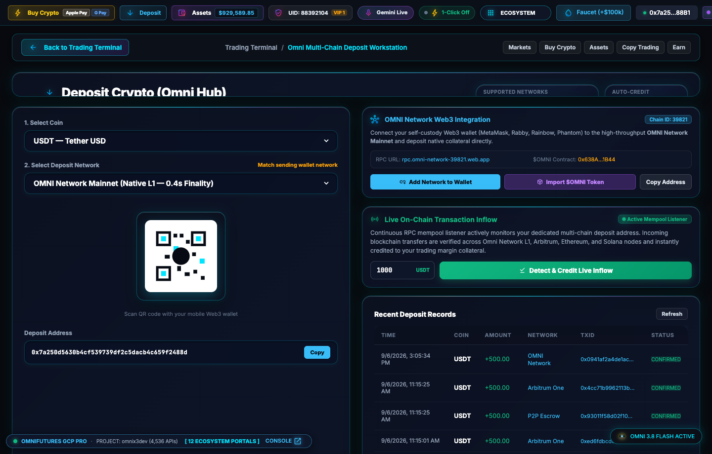
</div>

---

### 6. On-Chain Withdrawal Workstation
Enterprise-grade withdrawal hub providing instant blockchain settlements, gas fee estimators, address whitelisting, and multi-asset selection.

<div align="center">
  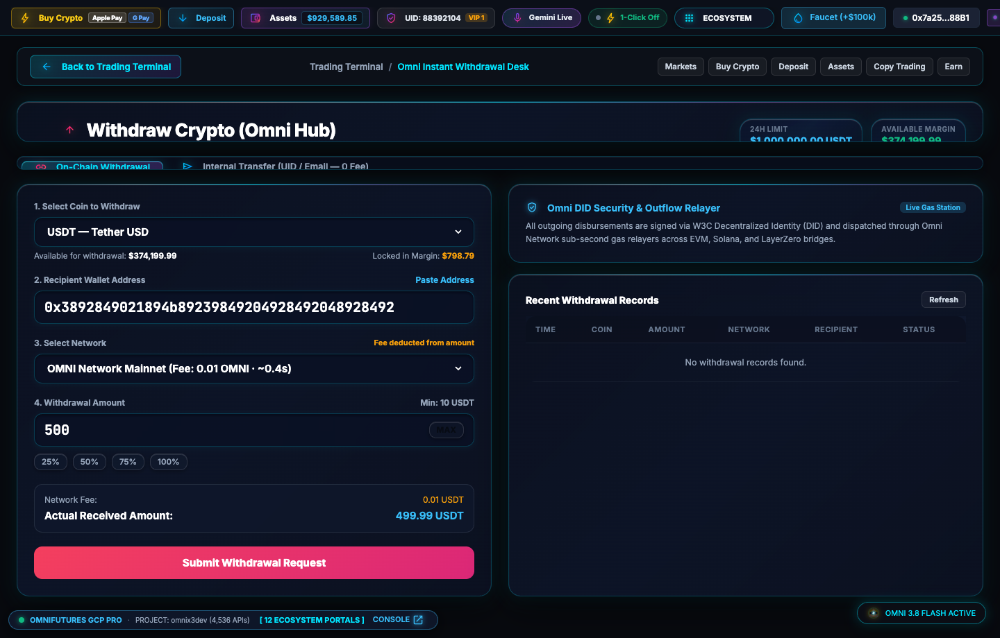
</div>

---

### 7. W3C Decentralized Identity (DID) & Biometric Enclave Security Engine
Next-generation sovereign security engine replacing legacy, SIM-swap-vulnerable 2FA with hardware biometric enclave verification (WebAuthn / Passkeys) and W3C Decentralized Identifiers (`did:omni:...`). Every capital disbursement generates a cryptographically bound challenge-response nonce and verifiable ECDSA secp256k1 proof before broadcast.

<div align="center">
  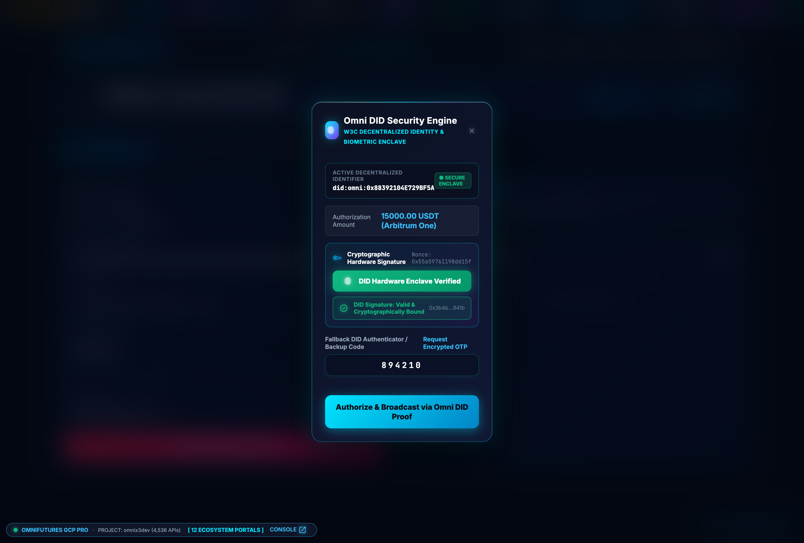
</div>

---

### 8. Assets Portfolio Hub & Balances Overview
Total net worth tracker reporting live portfolio valuations across the four core account pillars: **Futures Margin**, **Spot Account**, **Funding / Fiat**, and **Earn / Staking**. Highlights top holding balances including native **$OMNI Token (Native L1)**, USDT, BTC, ETH, and SOL with allocation progress bars and real-time PnL analytics.

<div align="center">
  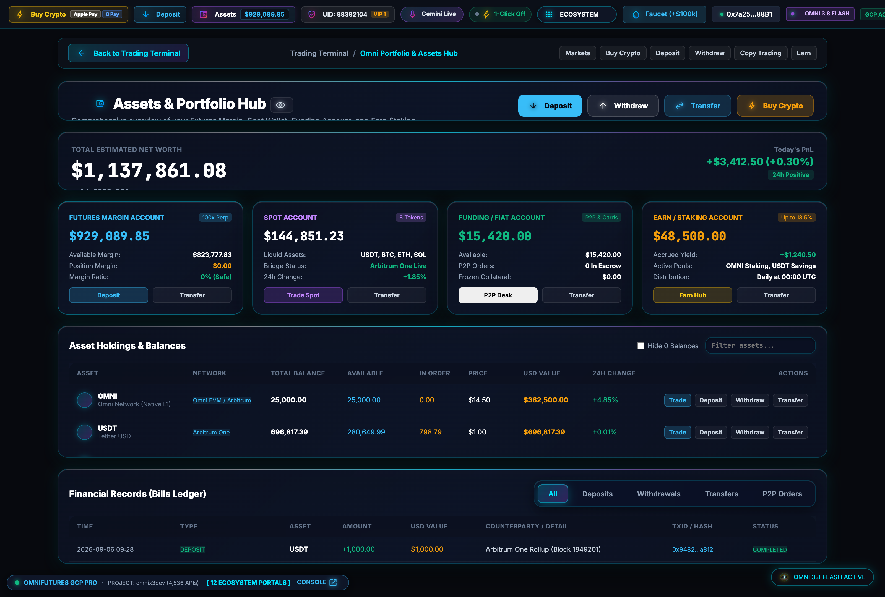
</div>

---

### 9. Sub-Zero Latency Internal Account Transfer
Instant 0-fee capital routing modal allowing traders to shift collateral seamlessly between Futures margin, Spot trading, P2P funding, and Earn yield accounts with instantaneous balance synchronization.

<div align="center">
  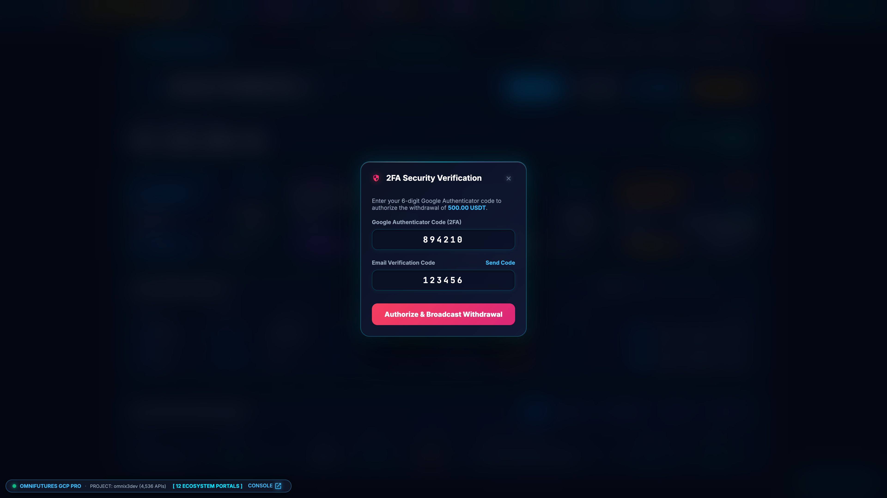
</div>

---

### 10. Copy Trading Engine & Leaderboard
Institutional quantitative copy trading platform featuring verified elite traders, 30-day ROI% performance matrices (up to +384.2%), maximum drawdown statistics, win rates, and 1-click automated order replication.

<div align="center">
  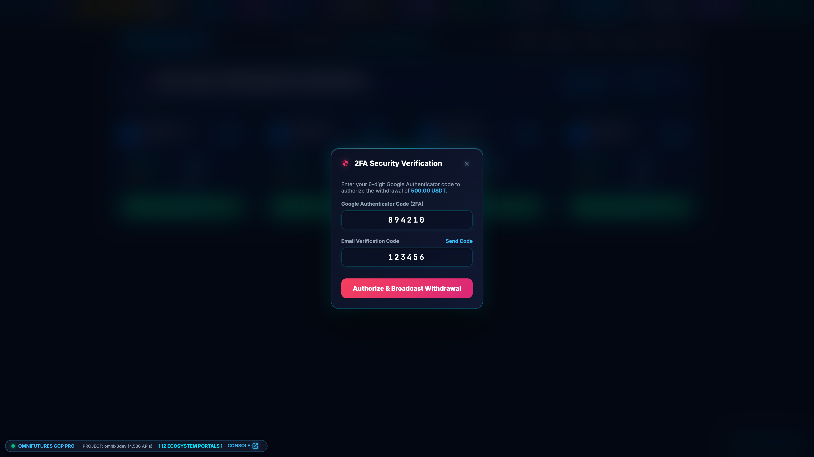
</div>

---

### 11. High-Yield Protocol Earn & Staking Vaults
Direct connection to the Omni Network decentralized yield infrastructure, delivering up to 18.5% APY on $OMNI staking, flexible stablecoin savings, and protocol revenue distribution via OmniDAO smart contracts.

<div align="center">
  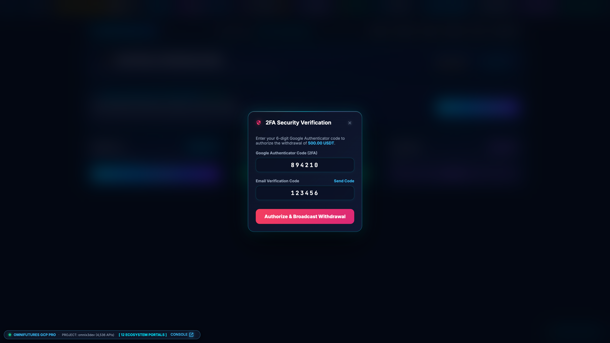
</div>

---

### 12. Gemini Live Autonomous Trading HUD & Multimodal Vision Workstation
The cutting-edge conversational trading desk powered by **Gemini Live (`gemini-3.1-flash-live-preview`)**. Features continuous hands-free Voice Activity Detection (VAD), fluid chromatic quantum orb oscilloscope, sub-15ms tool dispatch telemetry, real-time multimodal chart vision scan with support/resistance recognition, conversational speech synthesis, and 1-click voice action suggestions.

<div align="center">
  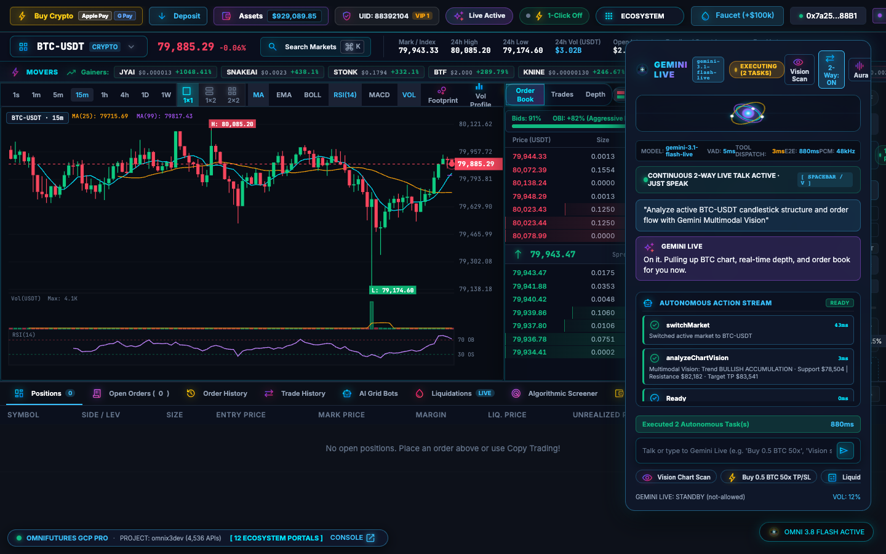
</div>

---

## 📁 Repository Structure

```
.
├── screenshots/
│   ├── 01_trading_terminal.png          # 200x Perpetuals terminal view
│   ├── 02_markets_overview.png          # 2,300+ markets directory
│   ├── 03_buy_crypto_express.png        # Fiat on-ramp checkout
│   ├── 04_buy_crypto_p2p.png            # P2P escrow trading desk
│   ├── 05_deposit_workstation.png       # Multi-network deposit hub
│   ├── 06_withdraw_workstation.png      # On-chain withdrawal workstation
│   ├── 07_withdraw_2fa_modal.png        # Omni DID Security Engine modal (W3C / Biometric Enclave)
│   ├── 08_assets_portfolio_hub.png      # Portfolio net worth, 4 pillars & $OMNI balances
│   ├── 09_internal_transfer_modal.png   # Sub-zero latency internal account transfers
│   ├── 10_copy_trading_engine.png       # Quant copy trading engine & master leaderboard
│   ├── 11_earn_staking_vaults.png       # 18.5% APY $OMNI staking & protocol yield vaults
│   ├── 12_gemini_live_trading_hud.png   # Gemini Live Multimodal Trading Copilot HUD
│   └── showcase_preview.png             # Master repository preview
├── index.html                           # Exchange SPA frontend
├── style.css                            # Liquid Glassmorphism design system
├── app.js                               # Reactive state engine & Gemini Live voice controller
├── server.py                            # SQLite database, matching engine & Gemini Live API backend
└── README.md                            # Documentation & feature showcase
```

---

## 💻 Local Development Setup

1. **Clone the repository**:
   ```bash
   git clone https://github.com/X3DevBlake/omni-futures.git
   cd omni-futures
   ```

2. **Start the matching engine backend**:
   ```bash
   python3 server.py
   ```

3. **Open the trading terminal**:
   Open `index.html` in any modern web browser or serve via:
   ```bash
   python3 -m http.server 8080
   ```

---

## 🌐 Live Production Deployment

Omni Futures is deployed live on Google Cloud Firebase Hosting:
- **Production URL**: [https://omni-futures-39821.web.app](https://omni-futures-39821.web.app)
- **Ecosystem Hub**: [https://omni-network-39821.web.app](https://omni-network-39821.web.app)
